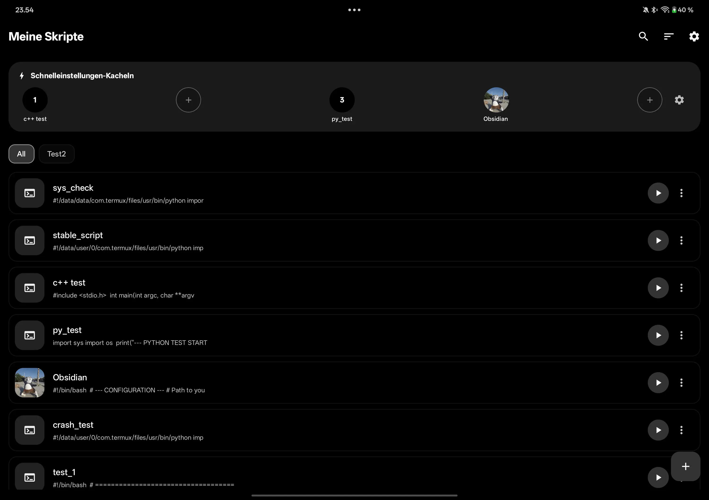
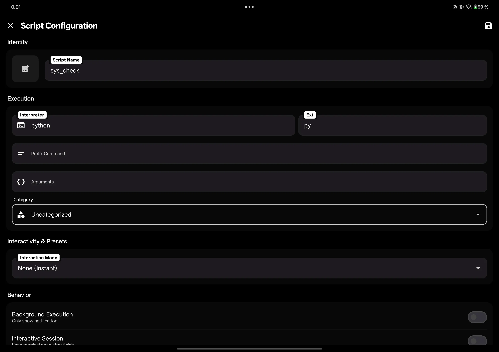
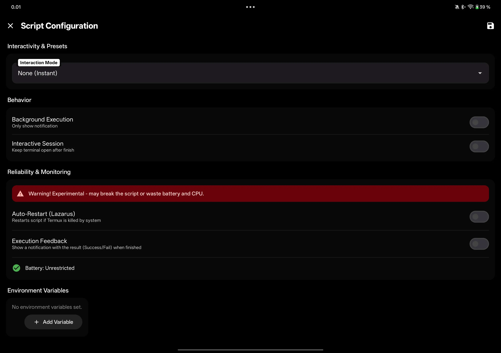
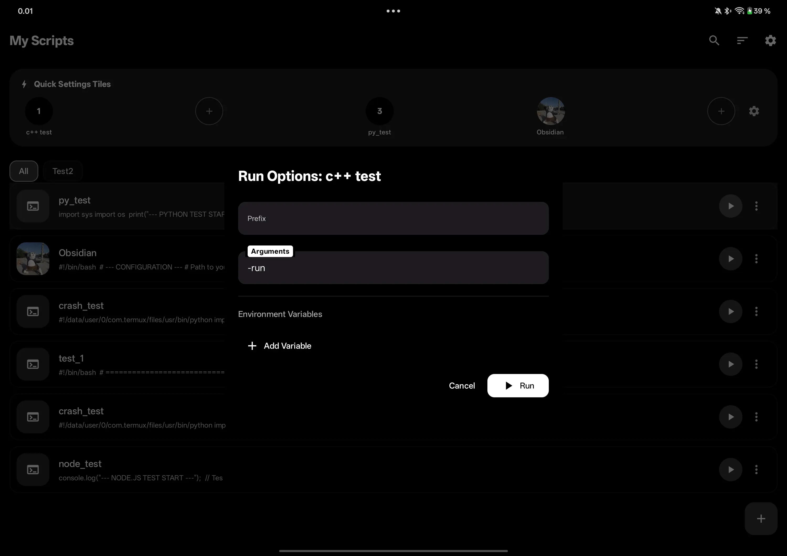
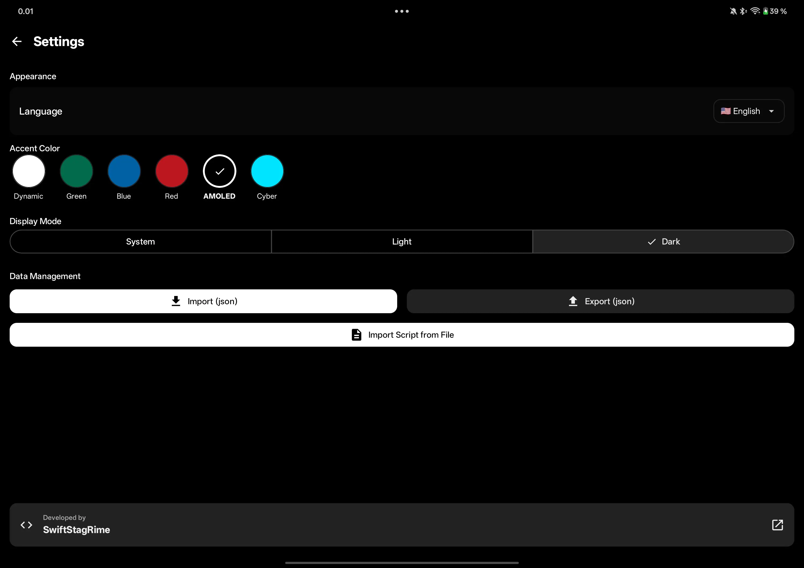

# Script Runner for Termux

A secure Android bridge for managing and executing scripts via Termux. This app allows you to automate tasks, manage environment variables, and create home screen shortcuts for your favorite scripts with a focus on security and ease of use.

## Features

*   **Integrated Script Editor:** Write and modify scripts directly within the app.
*   **Flexible Execution:** Support for background execution or interactive Termux sessions.
*   **Highly Configurable:**
    *   Support for any file extension.
    *   Custom prefix commands and arguments.
    *   Environment variable management.
    *   Up to 5 Quick Settings tiles for rapid access.
    *   Runtime parameters via text input or custom presets.
*   **Customization:** Personalize your script shortcuts with custom icons.
*   **Data Portability:** Full support for importing and exporting your script library (includes the script files themselves and JSON DTO metadata).
*   **Monitoring (Experimental):** Support for monitoring scripts and auto-restarting them if they are killed by the system (scripts that finish normally are not restarted).

## Remote Execution (ADB)

You can trigger script execution remotely via ADB using the following command:

```bash
adb shell am start \
  -n io.github.swiftstagrime.termuxrunner/io.github.swiftstagrime.termuxrunner.ui.features.adbtrigger.AdbTriggerActivity \
  --es io.github.swiftstagrime.termuxrunner.adb_code "YOUR_CODE_HERE"
```

> [!IMPORTANT]
> `YOUR_CODE_HERE` is the unique ADB code you specified when saving the script. It is empty by default. Note that remote execution ignores runtime arguments, as it is designed for non-interactive automation.

---

### App Showcase

| Home | Editor | Config & Monitoring | Quick Settings Tiles |
| :---: | :---: | :---: | :---: |
|  |  |  <br><br>  |  <br><br>  |

<br>

| Shortcut Management | Runtime Arguments | Settings |
| :---: | :---: | :---: |
|  |  |  |

<br>

### Live Demo

<p align="center">
  
  <br>
  <i>Watch the app in action: Running scripts, monitoring heartbeats, and terminal interaction.</i>
</p>

---

## Security First

Scripts often handle sensitive information, such as API keys in environment variables or private logic.

*   **Encrypted Storage:** All script data and configurations are stored in an encrypted database using **SQLCipher**.

## Setup & Onboarding

A streamlined onboarding process is included to simplify initial setup.

*   **Note on Permissions:** During setup, you will be asked to grant the `com.termux.permission.RUN_COMMAND` permission. While the system warning may look intimidating, this is the standard and necessary way for third-party apps to securely send commands to Termux.

## Compatibility

*   **Minimum SDK:** 24 (Android 7.0)
*   **Target SDK:** 36 (Android 16)
*   **Xiaomi / MIUI / HyperOS:** Specific fixes are included to handle the unique way these systems manage shortcut permissions.
*   **Other OEMs:** If shortcuts do not appear, please manually check "Background Start" or "Shortcut" permissions in system settings. Note that some OS flavors may silently reject permissions without notifying the app.

## Current Status

This project is currently in early development.

*   **Testing:** Various extensions have been tested and work as expected.
*   **Documentation:** Detailed code documentation is currently under construction.
*   **Translation:** English and Russian are manually translated; all other languages are AI-generated (switchable in settings).
*   **Performance Note:** `BasicTextField` may experience lag when handling files exceeding 170K characters on mid-range hardware (e.g., Snapdragon 7s Gen 2), though high-end chips (Snapdragon 8 Gen 3) perform smoothly. I am sticking with the current implementation to maintain stylus support.
*   **Stability:** While functional, please keep backups of vital scripts using the built-in export feature.

## Contributing

Contributions, bug reports, and feature requests are welcome! Feedback on how the app handles different script types or specific OS flavors is especially valuable during these early stages.
